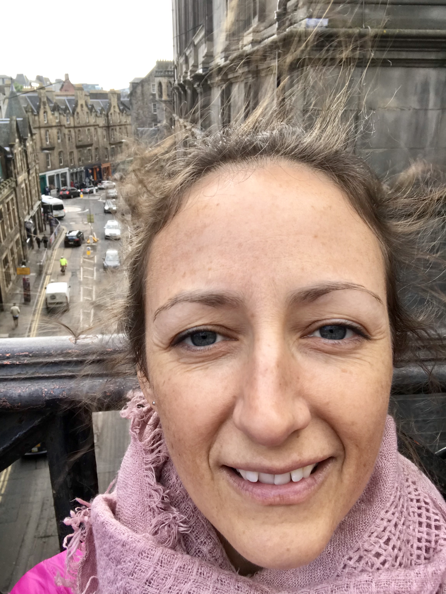
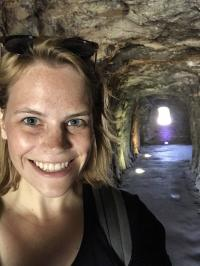

# si2021instructors

## Meet your 2021 Summer Institute instructors!

Hi, I'm [Rachael Blake](http://rachaeleblake.com).  

I lead the data science team at SESYNC, and I'm a quantitative marine ecologist.  My research focuses on biodiversity, community structure, and the impacts of multiple stressors in marine ecosystems.  I also study how changes in these ecosystems influence social and ecological well-being.  I use data synthesis as well as field and lab experiments to test assumptions and hypotheses.  I'm interested in furthering open science and use data science tools to improve workflows and reproducibility.  

My goals for this week:
- provide a positive learning space
- learn about your interesting research
- help you overcome conceptual or analytical project hurdles
- have fun!

=======

Hi, I'm [Renee Obringer](https://www.reneeobringer.com/).  

I am a postdoctoral researcher at SESYNC studying the human dimension of urban water systems under climate change. Within my research I leverage predictive modeling techniques to better understand climate impacts on urban water systems. Recently, I have been working to integrate data science techniques with social science data through agent-based modeling. I do nearly all of my research in R, but I particularly enjoy finding new ways to visualize my data through [ggplot](https://ggplot2.tidyverse.org/)! Outside of research, I enjoy traveling, cooking, reading books, and watching soccer. 
