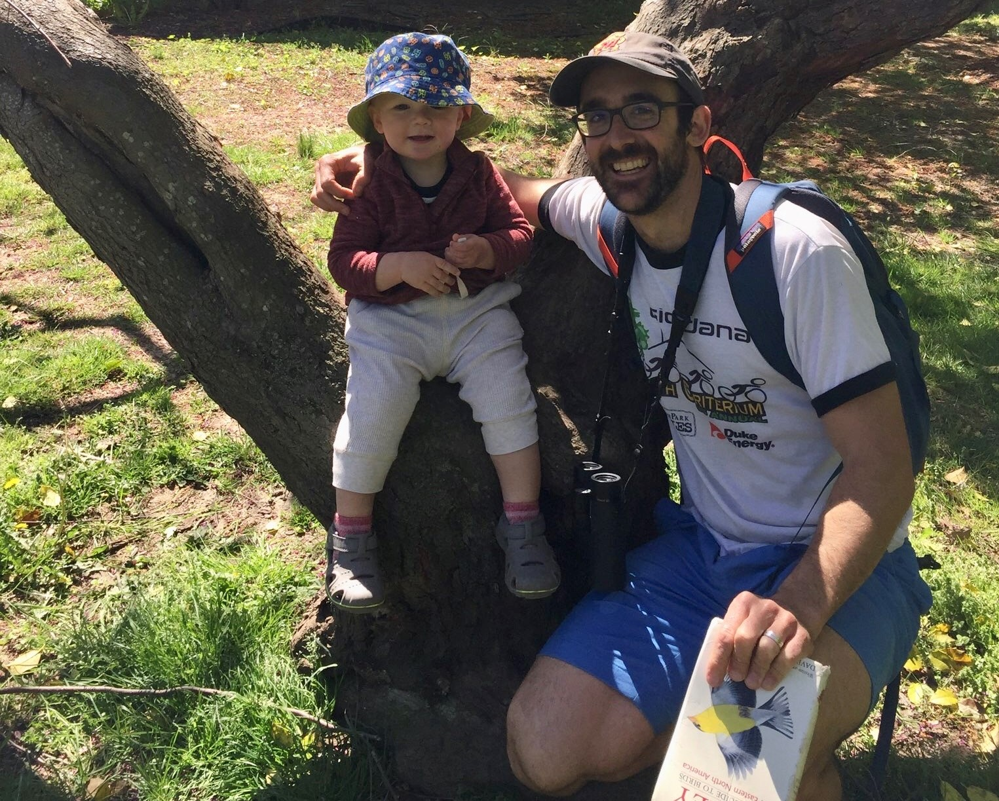
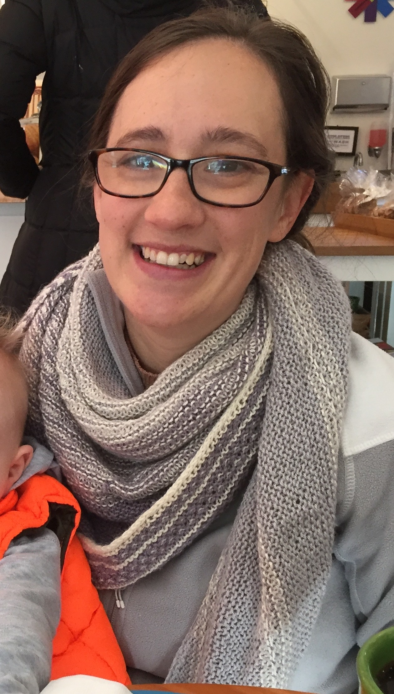

# si2021instructors

## Meet your 2021 Summer Institute instructors!

Hi, I'm [Rachael Blake](http://rachaeleblake.com).  

I lead the data science team at SESYNC, and I'm a quantitative marine ecologist.  My research focuses on biodiversity, community structure, and the impacts of multiple stressors in marine ecosystems.  I also study how changes in these ecosystems influence social and ecological well-being.  I use data synthesis as well as field and lab experiments to test assumptions and hypotheses.  I'm interested in furthering open science and use data science tools to improve workflows and reproducibility.  

My goals for this week:
- provide a positive learning space
- learn about your interesting research
- help you overcome conceptual or analytical project hurdles
- have fun!

=======

Hi, I'm [Renee Obringer](https://www.reneeobringer.com/).  

I am a postdoctoral researcher at SESYNC studying the human dimension of urban water systems under climate change. Within my research I leverage predictive modeling techniques to better understand climate impacts on urban water systems. Recently, I have been working to integrate data science techniques with social science data through agent-based modeling. I do nearly all of my research in R, but I particularly enjoy finding new ways to visualize my data through [ggplot](https://ggplot2.tidyverse.org/)! Outside of research, I enjoy traveling, cooking, reading books, and watching soccer. 

=======

Hello, I'm [Quentin Read](http://quentinread.com)!

I'm a SESYNC data scientist, and a plant ecologist by training. My SESYNC research focuses on assessing how the food we consume impacts the environment and biodiversity, and on finding cost-effective solutions to reduce food waste. I also contribute to a few different R packages: [rslurm](https://cyberhelp.sesync.org/rslurm), which helps people run code on computing clusters; [ggalluvial](https://corybrunson.github.io/ggalluvial), an add-on data viz package for ggplot2; and [Ostats](https://neon-biodiversity.github.io/Ostats), a community ecology data analysis tool. This is my second time helping teach the Summer Institute, and I'm excited to be one of your instructors this year! In my spare time I play the Irish flute, watch birds, and run/cycle.

My goals this week line up with Rachael's, especially having fun!

=======

Hello, I'm Mary Glover!

I am excited to join the SESYNC cyber team for the week to help teach the summer institute for the second year! 

I am an instructor at Bowie State University in Bowie, MD, where I teach introductory biology. My favorite part of teaching undergraduate biology is incorporating authentic research projects into laboratory classes. For my PhD, I studied the ecological and evolutionary forces that drive the formation of fly species that infest walnuts. In my free time, I enjoying knitting and listening to audiobooks.
